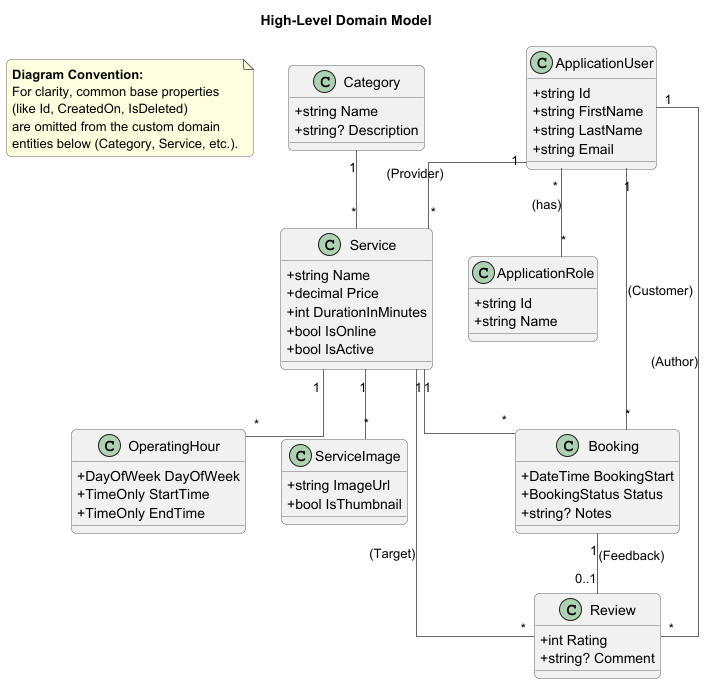

# Service Booking System

## Overview

This project is the final project for the university course:  
**[CSCB766 Programming with ASP .NET](https://ecatalog.nbu.bg/default.asp?V_Year=2021&YSem=6&Spec_ID=&Mod_ID=&PageShow=coursepresent&P_Menu=courses_part2&Fac_ID=3&M_PHD=0&P_ID=832&TabIndex=1&K_ID=13013&K_TypeID=10&l=1)** at [New Bulgarian University](https://www.nbu.bg/en).

Lecturer: Asst. Prof. Lachezar Tomov, PhD

## Project Introduction

The **Service Booking System** is a web application built with ASP.NET Core. It provides a platform where providers can offer services and customers can book available time slots. The system is designed with a clean, layered architecture and follows modern .NET development best practices.

## Table of Contents

- [Project Goal](#project-goal)
- [System Architecture & Design](#system-architecture--design)
- [User Roles](#user-roles)
- [Project Status & Key Features](#project-status--key-features)
- [Technology Stack](#technology-stack)
- [Getting Started](#getting-started)
- [Testing](#testing)
- [Contributing](#contributing)
- [License](#license)
- [Acknowledgments](#acknowledgments)

## Project Goal

The project's main goal is to build a functional service booking platform by applying professional, modern ASP.NET Core development practices. The focus is on creating a maintainable application with a clean, layered architecture that separates concerns effectively.

## System Architecture & Design

The application is built using a layered architecture to ensure a clean separation of concerns.

-   **Backend**: **ASP.NET Core 9.0**
-   **Architecture**: Layered (`Core`, `Data`, `Application`, `Infrastructure`, `Web`)
-   **Database**: **Entity Framework Core** with **Microsoft SQL Server**
-   **Authentication**: **ASP.NET Core Identity** (Cookies for MVC, JWT for API)

### Use Case Diagram

The following diagram provides a high-level overview of the system's functionality and the roles of its different users.


### Domain Model Diagram

The database schema is designed to support the core features of the application. It utilizes a flexible base entity hierarchy and a robust soft-delete pattern to ensure data integrity and history.



*(The project's `/docs/diagrams` folder contains the detailed PlantUML source files for these diagrams.)*

## User Roles

-   **Administrator**: The System Owner/Manager. Has global control over the entire application.
-   **Provider**: The Service Seller/Offeror. Registers themselves and provides the services.
-   **Customer**: The Service Buyer/Booker. Registers themselves to book available services.

## Project Status & Key Features

The project has a solid architectural foundation, with the following key patterns and features implemented:

1.  **Layered Architecture**: Solution structured into five layers: `.Core`, `.Data`, `.Application`, `.Infrastructure`, and `.Web`.
2.  **Identity & Authentication**: 
    -   ASP.NET Core Identity configured with custom `ApplicationUser` and `ApplicationRole` entities.
    -   **Hybrid Auth**: Supports Cookies for MVC views and **JWT (JSON Web Tokens)** for API endpoints.
    -   **Role-Based Access Control (RBAC)**: Granular permissions for Admin, Provider, and Customer.
    -   **Email Confirmation**: Registration flow includes email verification (via SendGrid or Logger).
3.  **Data Persistence Patterns**:
    -   A complete domain model with a flexible base entity hierarchy (`BaseEntity`, `DeletableEntity`).
    -   A **Soft-Delete** pattern implemented using EF Core's Global Query Filters.
    -   **Operating Hours**: Flexible schema for defining service availability per day of week.
4.  **Core Business Services**:
    -   **User Management**: Registration, Profile Management, Password Security, and Admin controls (Ban/Unban, Role Management).
    -   **Service Management**: Full CRUD for services, including **Multi-Image Gallery** (with thumbnail selection), Categorization, and Global Search.
    -   **Booking System**: A complete lifecycle engine handling Creation, Confirmation, Declining, Cancellation, **Rescheduling**, and Completion.
    -   **Availability Engine**: Complex logic to determine valid booking slots based on service duration, operating hours, and existing bookings.
    -   **Reviews**: Post-service rating and commenting system.
    -   **Notifications**: `INotificationService` orchestrates email delivery using `ITemplateService` for HTML rendering.
5.  **MVC Frontend**:
    -   **Service Catalog**: Public browsing and searching of services with dynamic filtering.
    -   **Booking Flow**: Interactive booking wizard with a dynamic time slot picker powered by AJAX.
    -   **Dashboards**: Dedicated "My Bookings" (Customer) and "Received Bookings" (Provider) dashboards for managing requests.
    -   **Provider Portal**: "My Services" dashboard allowing providers to Create, Edit, and Delete their offerings.
    -   **Image Gallery**: Integrated image management in the Service Edit form, allowing uploads, deletions, and thumbnail selection.
    -   **Provider CRM**: View customer details and history for received bookings.
    -   **Admin Area**: Dedicated Admin Dashboard using **AdminLTE** theme for User Management (List, Ban/Unban) and system oversight.
    -   **Profile Management**: Integrated profile page for updating personal details and changing passwords.
    -   **Rescheduling**: Customers can reschedule pending or confirmed bookings to a new available time slot.
6.  **API Layer**:
    -   **RESTful API**: Exposes core functionalities (Auth, Users, Services, Bookings, Availability, Reviews).
    -   **Search & Discovery**: Filtering endpoints for finding services.
    -   **Admin API**: Endpoints for user and system management.
    -   **Validation**: Input validation using Data Annotations and `ModelState` error reporting.
7.  **Infrastructure Layer & External Services**:
    -   **Email Notifications**: Automated transactional emails (Booking Created, Confirmed, Declined, Cancelled, Rescheduled) using `SendGrid` (production) or `NullEmailService` (development).
    -   **Cloud Storage**: Integration with **Cloudinary** for image hosting and transformation.
    -   **Templating**: `ITemplateService` for rendering HTML email templates.
8.  **Database Seeding**: 
    -   A decoupled, composite seeder pattern for essential data (`Roles`, `Administrator`).
    -   **Demo Data**: A `DemoDataSeeder` that populates the development database with sample Providers, Services, and Operating Hours for rapid testing.
9.  **Testing**:
    -   **Unit Tests**: High coverage using xUnit and Moq for business logic.
    -   **Integration Tests**: Tests using **Testcontainers (SQL Server)** and **Respawn** to verify the full stack against a real database.
    -   **Test Infrastructure**: Custom `TestAuthHandler` for role simulation and `MockAntiforgery` for simplified controller testing.
10. **Logging**: Configured Serilog for structured logging to both the console and rolling files.

## Technology Stack

-   **Backend:** .NET 9, ASP.NET Core
-   **Data Access:** Entity Framework Core 9
-   **Database:** Microsoft SQL Server
-   **Authentication:** ASP.NET Core Identity, JWT Bearer
-   **Frontend:** ASP.NET Core MVC, Razor Pages, Bootstrap 5, jQuery, **AdminLTE**
-   **Testing:** xUnit, Moq, Testcontainers, Respawn
-   **Logging:** Serilog
-   **Email:** SendGrid
-   **Image Storage:** Cloudinary

## Getting Started

### Prerequisites

-   .NET 9 SDK
-   A code editor (e.g., JetBrains Rider, Visual Studio)
-   **Docker Desktop** (Required for Integration Tests)
-   (Optional) A SendGrid account and API key for testing real email sending.
-   (Optional) A Cloudinary account for image uploads.

### Configuration

1.  Clone the repository.
2.  The application uses `appsettings.Development.json` for local development configuration. Ensure the `ConnectionStrings` section is configured for your local database.
3.  **API Keys (Important!):** It is strongly recommended to store sensitive keys using the .NET Secret Manager. To set the secrets, navigate to the `ServiceBookingSystem.Web` project directory in your terminal and run:
    ```bash
    dotnet user-secrets init
    dotnet user-secrets set "Jwt:Key" "YOUR_SUPER_SECRET_KEY_MIN_32_CHARS"
    dotnet user-secrets set "EmailSettings:SendGridApiKey" "YOUR_SENDGRID_API_KEY"
    dotnet user-secrets set "Cloudinary:CloudName" "YOUR_CLOUD_NAME"
    dotnet user-secrets set "Cloudinary:ApiKey" "YOUR_CLOUDINARY_API_KEY"
    dotnet user-secrets set "Cloudinary:ApiSecret" "YOUR_CLOUDINARY_API_SECRET"
    ```
4.  **Email Configuration (Null vs Real):**
    The application supports two modes for email delivery:
    *   **Development (NullEmailService):** By default, emails are **not sent**. Instead, the email content (To, Subject, Body) is logged to the console. This is useful for testing without spamming real addresses.
    *   **Production (SendGrid):** To send real emails, configure the following in `appsettings.json` or User Secrets:
        ```json
        "EmailSettings": {
          "EnableRealEmail": true,
          "SendGridApiKey": "YOUR_API_KEY"
        }
        ```

### Running the Application

1.  **Database Setup:** The application automatically applies migrations and seeds data on startup.
    *   **Note:** If you want to reset the demo data (Services, Availability), drop your local database, and the `DemoDataSeeder` will recreate it on the next run.
2.  **Run:** `dotnet run --project ServiceBookingSystem.Web`
3.  **Access:** Open `https://localhost:7045` (or the port shown in your console).

## Testing

The project employs the following testing strategy.

### Unit Tests
Located in `ServiceBookingSystem.UnitTests`.
-   **Focus:** Business logic in the Application layer.
-   **Tools:** xUnit, Moq, EF Core In-Memory (for simple repository mocking).
-   **Run:** `dotnet test ServiceBookingSystem.UnitTests`

### Integration Tests
Located in `ServiceBookingSystem.IntegrationTests`.
-   **Focus:** API Endpoints, Database Constraints, Middleware, and Full Request Lifecycle.
-   **Infrastructure:** Uses **Testcontainers** to spin up a real SQL Server Docker container for the test suite. Uses **Respawn** to wipe the database clean between every test method.
-   **Logging:** Application logs are piped to the xUnit output window using `MartinCostello.Logging.XUnit`.
-   **Requirement:** Docker must be running.
-   **Run:** `dotnet test ServiceBookingSystem.IntegrationTests`

## Contributing

As this is a university course project, contributing is generally not required. However, feedback and suggestions are welcome.

## License

This project is licensed under the MIT License. See the [LICENSE](https://github.com/StefanYankov/service-booking-system/blob/master/LICENSE) file for details.

## Acknowledgments

This project was developed as part of the **CSCB766 Programming with ASP .NET** course at [New Bulgarian University](https://www.nbu.bg/en).
Special thanks to the course instructor or the guidance and project requirements.
